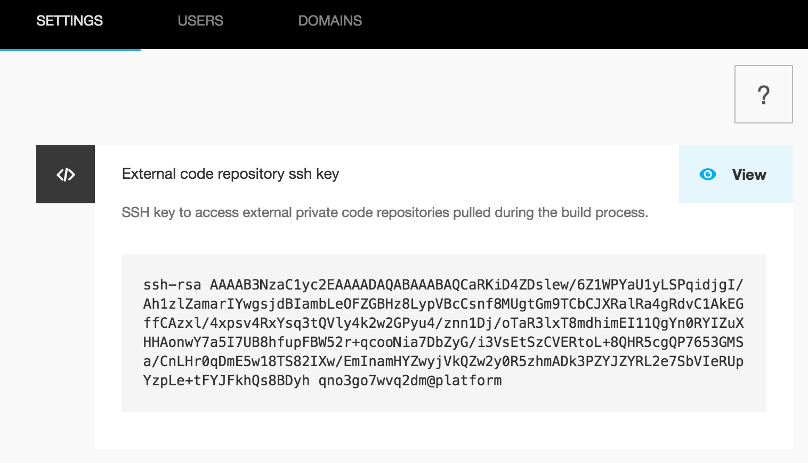
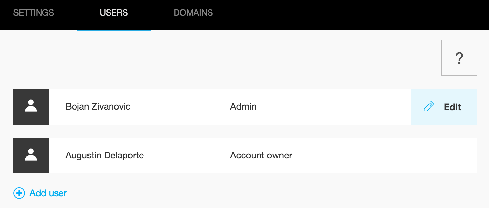
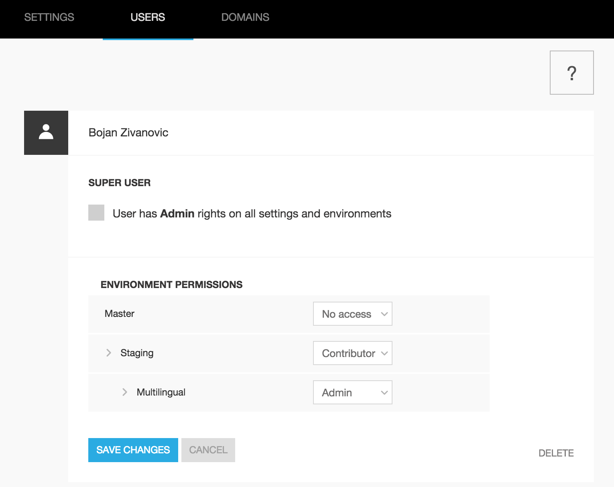
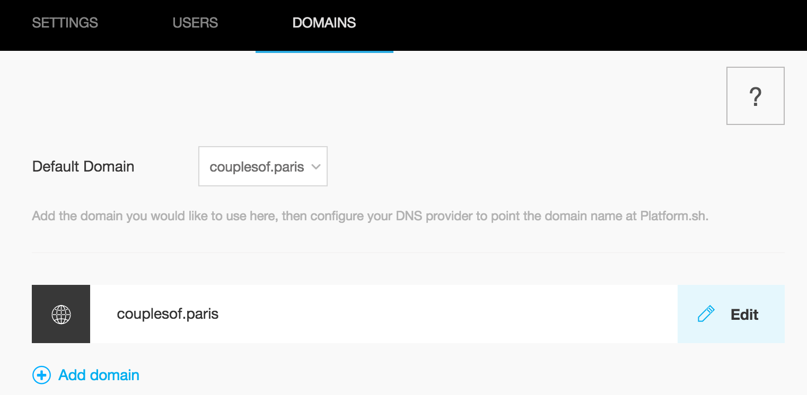

# Project configuration

You can access the configuration page of your project by clicking the
gear icon next to the project name.

## Settings

The `Settings` screen provides the SSH key that Platform.sh will use
when trying to access external private Git repository during the build
process.

This is useful if you want to reuse some code components accross
multiple projects and manage those components as dependencies of your
project.

## Users

The `Users` screen allows you to manage users access on your project.

You can invite new users to your project by clicking the `Add user` link
and entering their email address, or modify permissions of existing
users by clicking the `Edit` link when hovering the user.

Selecting a user will allow you to either edit that user's permissions
or delete the user's access to the project entirely.

If you check the `Super user` box, this user will be an administrator of
the project and will have fulll access on all environments. If you
uncheck the box, you'll have the option of adjusting the user's
permissions on each environment.

> **note**
> The `Account owner` is locked and you can't change its permissions.

## Domains

The `Domains` screen allows you to manage your domains that your project
will be accessible at.

